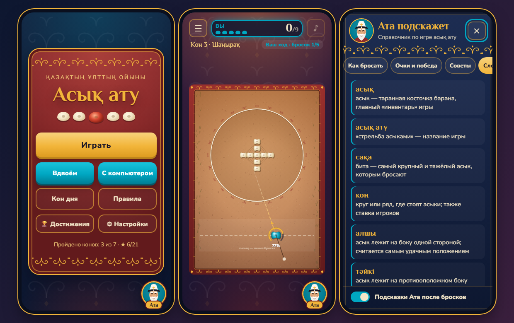

# Асық ату

> **▶ Играть онлайн:** [https://ekpinovmadi730-creator.github.io/Asyk/](https://ekpinovmadi730-creator.github.io/Asyk/)



Браузерная 2D-игра по мотивам казахской национальной игры **асық ату** — «стрельба асыками». На земле нарисован круг (кон), в центре в ряд стоят асыки (бараньи косточки). Игрок бросает свою биту — **сақа** — и старается выбить асыки за линию круга.

Игра написана на чистом HTML, CSS и JavaScript (canvas), без сборщиков и зависимостей. Интерфейс на русском и казахском языках. Играть удобно и на компьютере, и на телефоне; игру можно установить на телефон как приложение, и тогда она работает без интернета.

## Как запустить

- **Локально:** открыть `index.html` в браузере. Всё работает, кроме офлайн-режима и установки: им нужен адрес `http(s)://`.
- **GitHub Pages:** загрузить репозиторий на GitHub → *Settings → Pages → Deploy from a branch* → ветка `main`, папка `/ (root)`.
- **Установить на телефон:**
  - **Android (Chrome):** «Настройки» в игре → «Установить на телефон», или меню браузера → «Добавить на главный экран».
  - **iPhone (Safari):** «Поделиться» → «На экран Домой».

## Правила

### Порядок действий

1. На поле нарисован круг, в центре круга в ряд стоят асыки.
2. Игрок **зажимает сақа** мышью или пальцем.
3. Игрок **тянет назад**, как рогатку. Направление броска противоположно оттяжке, а сила зависит от её длины.
4. Игрок **отпускает**, и сақа летит. Сақа и асыки движутся по физике: трение, столкновения, отскоки от бортов. Готовой анимации нет, результат зависит только от броска.
5. Когда всё на поле остановилось, подводится итог броска, и сақа возвращается на линию.

Если отпустить сақа почти без оттяжки, бросок отменяется и не тратится.

### Начисление очков

- Асык, который после броска остановился **за границей круга** (его центр за линией), приносит **1 очко**.
- Выбитый асык убирается с поля, поэтому каждый асык считается **только один раз**.
- На коне «Қос кон» два круга: асык выбит, когда покинул **свой** круг.

### Условие победы

- У игрока **5 бросков** на раунд.
- **Победа:** выбить все асыки до конца бросков.
- Если броски закончились раньше, показывается результат: сколько асыков выбито из скольких.
- Вдвоём и против компьютера побеждает тот, кто выбил больше асыков. При равном счёте — ничья.

## Традиционные правила и упрощения

### Как играют по-настоящему

Асық ату — одна из самых старых игр казахских детей и подростков. Правила различаются от региона к региону, но основа общая:

- На ровной земле чертят круг или линию. Каждый игрок ставит в ряд свои асыки — это его ставка.
- Очерёдность часто определяют, подбрасывая асык: важно, какой стороной он упадёт (**алшы**, **тәйкі**, **бүк**, **шік**).
- Бросают **сақа** — самый крупный и тяжёлый асык, нередко утяжелённый свинцом и окрашенный. Бросают рукой с установленного расстояния.
- Выбитые за черту асыки игрок **забирает себе**. Пока он выбивает, он часто бросает снова.
- Если сақа осталась внутри круга, игрок может потерять ход или даже поставить сақа в кон.
- Выигрывает тот, кто собрал больше асыков.

### Что упрощено в этой версии

- Нет ставок и «выигрыша» асыков: вместо этого начисляются очки.
- У каждого игрока 5 бросков.
- Бросок рукой заменён оттяжкой, как у рогатки.
- Вид строго сверху: асыки на поле не переворачиваются, стороны асыка важны только в жеребьёвке.
- Асык засчитывается, если после остановки его центр оказался за линией круга.
- По обычным правилам удачный бросок не даёт лишнего хода и нет штрафа за сақа в круге. Эти правила есть в режиме **«Традиционные правила»** (см. ниже).

## Авторские дополнения

Этих элементов нет в традиционной игре, они добавлены для удобства и интереса.

### Режимы

- **Тренировка** — одиночная игра по конам.
- **Вдвоём** на одном устройстве. Игроки бросают по очереди на одном поле, у каждого 5 бросков и своя цветная сақа (бирюзовая и красная).
- **С компьютером.** Три уровня сложности: лёгкий, средний и сложный. Компьютер перебирает варианты броска на копии поля и выбирает лучший. Затем добавляет «человеческую» ошибку: слабый часто промахивается, сильный бьёт почти идеально. Думает небольшими порциями, поэтому телефон не подвисает. Видно, как он переставляет сақа и натягивает рогатку.
- **Кон дня** — новая расстановка каждый день, одна для всех игроков: она вычисляется из даты. Сохраняется лучший результат дня.
- **Традиционные правила** — переключатель на экране выбора кона. В этом режиме:
  - выбил асык — бросаешь ещё раз, и бросок не тратится;
  - сақа осталась в коне и ничего не выбила — следующий бросок сгорает.

  Звёзды и рекорды в этом режиме не начисляются.
- **Жеребьёвка асыком** перед игрой вдвоём и с компьютером. Каждый подбрасывает асык. Стороны старшие по порядку: алшы › тәйкі › бүк › шік. Бока (алшы и тәйкі) выпадают реже. У кого выпала сторона старше, тот бросает первым; при равенстве — перебрасывают.

### Коны (уровни)

Всего 7 конов, каждый со своей механикой. Следующий открывается после победы в предыдущем.

| № | Кон | Что особенного | Время суток |
|---|-----|----------------|-------------|
| 1 | **Бастау** | 5 асыков в ряд, небольшой круг | день |
| 2 | **Қос қатар** | 7 асыков в два ряда, круг шире | день |
| 3 | **Шаңырақ** | 9 асыков крестом, широкий круг, асыки скользят хуже | закат |
| 4 | **Құм** | вязкий песок: всё быстро останавливается | день |
| 5 | **Ауыр асық** | через один — тяжёлые тёмные асыки, их труднее выбить | закат |
| 6 | **Тастар** | неподвижные камни между линией броска и коном | ночь |
| 7 | **Қос кон** | два маленьких круга, 10 асыков | ночь |

Проходимость каждого кона за 5 бросков проверена: программа перебирала броски на симуляции.

### Прогресс

- **Звёзды за кон:** ★ — победа, ★★ — победа за 4 броска, ★★★ — за 3.
- **Достижения** (10 штук), например:
  - «Три за бросок»;
  - «Без промаха» — победа, когда асык выбит каждым броском;
  - «Мерген» — ★★★ на любом коне;
  - «Шебер» — ★★★ на всех конах;
  - «Сильнее машины» — победа над сложным компьютером;
  - «Алшы!» — выпало алшы в жеребьёвке.

  Новое достижение всплывает сверху экрана, все собраны на отдельном экране.

### Помощник-справочник «Ата»

- В углу любого экрана — кнопка с дедушкой-аксакалом в белом калпаке и чапане.
- По нажатию открывается справочник с вкладками:
  - «Как бросать»;
  - «Очки и победа»;
  - «Советы»;
  - «Словарь»: асық, сақа, кон, алшы, тәйкі, бүк, шік, сызық, ата — с переводом;
  - «Традиционные правила».
- Во время игры справочник работает как пауза: сақа замирает в полёте. Закрывается крестиком, клавишей `Esc` или нажатием мимо панели.
- После броска Ата иногда даёт короткую подсказку в «облачке». Это **правила в коде, а не ИИ**: игра смотрит на силу и угол броска, попала ли сақа в асык или в камень и насколько прямо, сколько асыков вылетело. По этим данным выбирается фраза, например:
  - «сақа не долетела, тяни до 60–80%»;
  - «пунктир прошёл левее асыков»;
  - «удар по касательной»;
  - «сақа попала в камень»;
  - «сразу 3 за бросок!».
- Промахи и крупные удачи Ата комментирует всегда, обычное +1 — примерно через раз. Одну и ту же мысль подряд он не повторяет. Подсказки можно выключить.

### Эффекты и ощущения

- **Пыль при ударах:** частицы разлетаются от места столкновения, их больше при сильном ударе; от камня пыль серая.
- **След** цвета игрока за летящей сақа.
- **Повтор.** Если одним броском выбито 2 асыка и больше, появляется кнопка «▶ Повтор»: бросок проигрывается ещё раз в замедлении. Повтор — это не запись, а тот же бросок, пересчитанный заново: физика с фиксированным шагом каждый раз даёт тот же результат. Нажатие на поле или `Esc` пропускает повтор.
- **Время суток:** день в степи, тёплый закат, синяя ночь со звёздами и лунным светом. Меняются и поле, и фон вокруг.
- **Вибрация** на телефоне: лёгкий толчок при ударе, двойной — при выбитом асыке и новом достижении (работает на Android).
- **Звуки** генерируются в коде: сухой стук кости о кость, глухой удар о борт, щипок домбры за очко, короткая мелодия в конце раунда.

### Удобство

- **Два языка:** русский и қазақша, переключаются в настройках на лету, выбор сохраняется. Справочник и правила тоже переведены.
- **Для левши:** кнопка Ата и подсказки переезжают влево, кнопки паузы и звука меняются местами.
- **Крупный интерфейс:** больше кнопки, текст и зона захвата сақа.
- **На телефоне:**
  - кнопки не меньше 44 px;
  - меню, коны и справочник прокручиваются пальцем;
  - справочник и настройки открываются во весь экран;
  - учтены вырезы экрана (safe area);
  - когда телефон лежит боком, HUD сжимается в одну строку.
- **Обучение для новичка** при первом запуске: пошаговая подсказка и анимированный «палец».
- **Пауза:** кнопка ☰ или `Esc`. Игра встаёт на паузу сама, если свернуть вкладку.
- **Линия прицела и шкала силы:** пунктир, «резинка» рогатки и цветная дуга силы (зелёный, золотой, красный).
- **Перестановка сақа:** нажатие на линии броска переносит сақа туда, так можно выбрать угол.
- **Подсветка:** асык, который уже за линией, но ещё катится, светится золотом.

### Национальное оформление

- Орнамент «қошқар мүйіз» (бараний рог) по рамке поля и вокруг кона.
- Рамка поля в духе красного войлочного ковра-текемета.
- Степная земля с ковылём, песок, камни.
- Шаңырақ (купол юрты) в центре круга.
- Бирюза и золото флага Казахстана.
- Асыки нарисованы в характерной форме, как их видно сверху; тяжёлые — тёмные.

## Советы: как улучшить бросок

1. **Не бейте в полную силу.** Чаще всего хватает 60–80% силы. Сильнее — и сақа пролетает ряд насквозь или улетает в борт, а асыки разлетаются непредсказуемо.
2. **Бейте вдоль ряда, а не поперёк.** Переставьте сақа ближе к краю линии броска и цельтесь в крайний асык под углом. Тогда сақа пройдёт по ряду и может выбить сразу два-три асыка.
3. **Цельтесь в центр асыка.** Скользящий удар отводит асык вбок, и он остаётся в круге. Прямой удар передаёт больше энергии, и асык уходит за линию.
4. **Добивайте одиночек у края.** Асык, который после прошлого броска остановился у самой линии, выбить легче всего: на него хватит и слабого точного броска.
5. **Тяжёлые асыки и камни.** Тёмный асык тяжелее — бейте его сильнее и прямо. Камень не сдвинуть: ищите просвет или заходите сбоку.

## Реализованные функции

- Стартовый экран: «Играть», «Вдвоём», «С компьютером», «Кон дня», «Правила», «Достижения», «Настройки».
- Выбор кона со звёздами и рекордами, выбор сложности компьютера и переключатель традиционных правил.
- Бросок сақа в стиле рогатки мышью и касанием (Pointer Events, захват указателя, отмена слабого броска).
- Физика кругов:
  - трение скольжения и вязкое затухание;
  - упругие столкновения с учётом масс: сақа тяжелее асыка, тяжёлые асыки тяжелее обычных;
  - неподвижные камни;
  - касательное трение и закрутка;
  - отскоки от бортов;
  - фиксированный шаг 1/240 с.
- HUD: очки, оставшиеся броски, чей ход, номер броска, «компьютер думает…».
- Экран результата: очки, победа или проигрыш, звёзды, лучший результат, новые достижения, кнопки «Играть снова», «Следующий кон», «В меню».
- Сохранение в `localStorage`:
  - лучшие результаты (отдельно для одиночной игры и игры вдвоём);
  - звёзды, открытые и пройденные коны;
  - достижения и результат «Кона дня»;
  - обучение и все настройки.

  Данные из хранилища проверяются перед использованием.
- PWA: манифест, иконки, service worker. После первого запуска игра работает без интернета.
- Адаптивная вёрстка для телефона (стоя и лёжа) и компьютера, поддержка Retina-экранов.

## Технологии

- HTML5, CSS3 (custom properties, grid, flexbox, анимации, SVG-орнаменты в data URI).
- JavaScript (ES5+), без фреймворков и сборщиков.
- Canvas 2D: отрисовка поля и объектов, кэширование статичного фона, частицы.
- Pointer Events: единый ввод для мыши, касания и пера.
- Web Audio API: звуки генерируются в коде, аудиофайлов нет.
- Vibration API: отклик на телефоне.
- `localStorage`: прогресс, рекорды и настройки.
- Web App Manifest и Service Worker: установка на телефон и офлайн-режим.
- Google Fonts: Philosopher и Nunito, обе с поддержкой казахской кириллицы.
- Content Security Policy в `index.html`: скрипты только из своего источника, без inline-скриптов и `eval`.

## Структура

```
index.html            — экраны и разметка, тексты справочника на двух языках
manifest.webmanifest  — описание приложения для установки
sw.js                 — service worker: офлайн-режим
css/style.css         — оформление
js/i18n.js            — тексты интерфейса: русский и казахский
js/levels.js          — коны, размеры поля, генератор «Кона дня»
js/storage.js         — сохранение прогресса и настроек (localStorage)
js/audio.js           — синтез звуков
js/physics.js         — физика кругов и камней
js/render.js          — отрисовка на canvas: поле, асыки, пыль, след
js/ata.js             — помощник Ата: справочник и правила подсказок
js/bot.js             — компьютерный соперник
js/game.js            — логика игры, режимы, ввод, экраны, обучение
icons/                — иконки приложения
docs/screenshot.png   — скриншот для README
```

## AI-инструменты

- **Claude Code**: генерация кода игры, визуальный стиль, проверка физики и баланса уровней, тестирование в headless-браузере.
